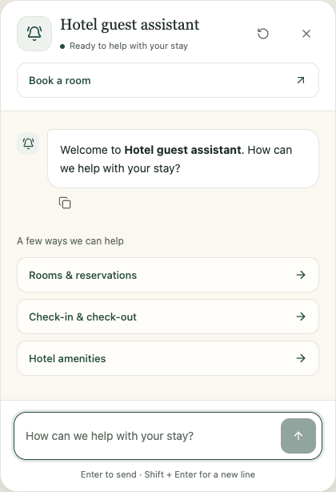
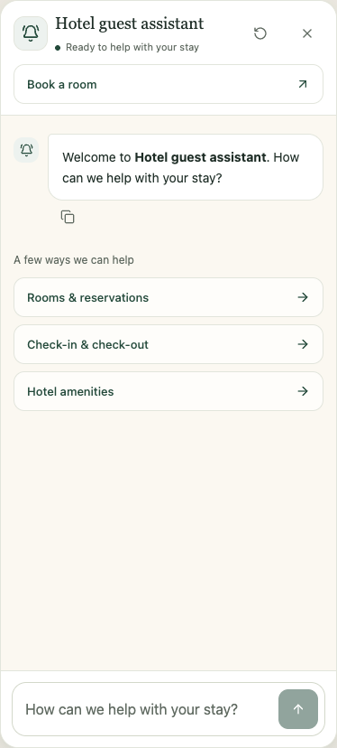

# Concierge widget refresh

The floating widget now uses forest green, ivory, serif headings, softer message
surfaces, and a rounded composer. It retains the existing assistant-ui runtime
and worker integration, with local shadcn Button, Avatar, and AlertDialog components.

Starter questions fill the composer without sending. A configured booking URL
opens in a new tab. User-initiated restart asks for confirmation when there is
history; cancellation keeps the conversation and draft. The same confirmation
handles session-expiry links.

The phone panel uses the visible viewport and safe-area margins. Opening focuses
the close control without opening the keyboard; choosing a prompt focuses the
composer. Closing, reopening, and resizing keep the draft. Scrolling to the
latest message moves focus to the panel so Escape remains usable.

## Previews

## Validation

- `npm run typecheck`: passed.
- `npm run lint`: passed.
- `npm run test:ui`: 24 checks passed across Chromium and WebKit.
- `npm run build`: all six production/staging variants passed.
- Standards review: no blocking issues; one optional note about a shallow DOM
  lookup used for focus management.
- Spec review: the dynamic-viewport fallback issue was fixed and regression
  tested; no remaining actionable gaps.

Browser checks used the real widget/runtime/worker with a controlled local
Socket.IO fixture. They covered starter questions, booking, reset/expiry,
reconnecting, scroll-to-latest, empty restart, history restoration, errors,
Markdown, multiline input, copy (Chromium), mobile bounds, focus, reduced motion,
and host-style isolation. The visualViewport-unavailable regression also
simulated a viewport change without a window resize event.

Physical mobile Safari/Chrome software-keyboard behavior, the live backend, and
deployment on a real host site were not verified. Public props, module exports,
server payloads, storage keys, and host events retain their existing contracts.
