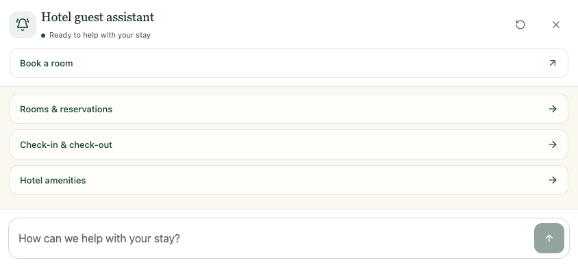
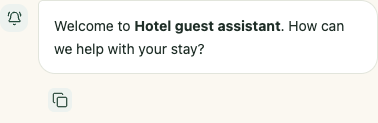

# Concierge widget refresh

The floating widget now uses forest green, ivory, serif headings, softer message
surfaces, and a rounded composer. It retains the existing assistant-ui runtime
and worker integration, with local shadcn Button, Avatar, and AlertDialog components.

Starter questions fill the composer without sending. A configured booking URL
opens in a new tab. User-initiated restart asks for confirmation when there is
history; cancellation keeps the conversation and draft. The same confirmation
handles session-expiry links.

Copy uses a 16px outlined icon, transparent at rest, with a 24px mint hover/focus
tile inside a 44px touch target. The action row sits below the message bubble,
with the icon aligned under the text. Clipboard, tooltip, and copied checkmark
behavior are retained.

The phone panel fills the visible viewport edge to edge, without an outer frame.
Safe-area padding sits inside the header, message area, booking row, and composer.
This applies at widths up to 640px, plus touch-device landscape layouts up to
1024px wide and 500px high. The open panel hides the launcher. Opening focuses
the close control without opening the keyboard; choosing a prompt focuses the
composer. Closing, reopening, and resizing keep the draft. Scrolling to the
latest message moves focus to the panel so Escape remains usable. The development
page uses `viewport-fit=cover`; the widget leaves host metadata under host control.

## Previews

## Validation

- `npm run typecheck`: passed.
- `npm run lint`: passed.
- `npm run test:ui`: 26 checks passed across Chromium and WebKit.
- `npm run build`: all six production/staging variants passed.
- Standards review: no blocking issues.
- Spec review: no remaining actionable gaps.

Browser checks used the real widget/runtime/worker with a controlled local
Socket.IO fixture. They covered starter questions, booking, reset/expiry,
reconnecting, scroll-to-latest, empty restart, history restoration, errors,
Markdown, multiline input, copy (Chromium), mobile bounds, focus, reduced motion,
and host-style isolation. Mobile checks require full coverage at 320px, 390px,
and 640px, plus touch-device landscape and shrinking viewports. The
visualViewport-unavailable regression also simulated a viewport change without
a window resize event. Copy screenshots were inspected in resting, hover,
keyboard-focus, and copied states.

Physical mobile Safari/Chrome software-keyboard behavior, the live backend, and
deployment on a real host site were not verified. Public props, module exports,
server payloads, storage keys, and host events retain their existing contracts.
