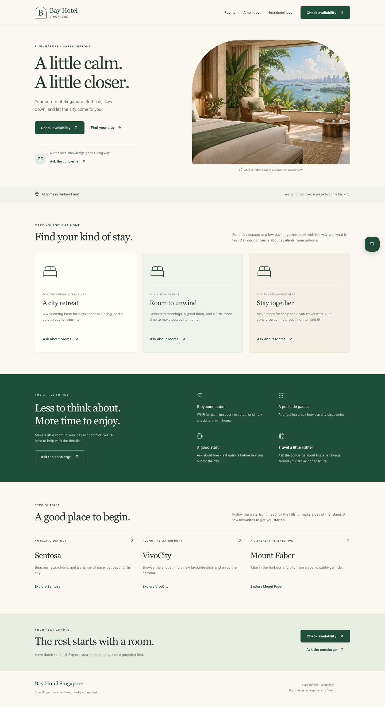
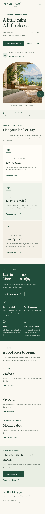

# Bay Hotel guest page

The guest page replaces the Vite starter screen with a green-and-ivory hotel
welcome page. It includes room concepts, amenities, a HarbourFront neighbourhood
guide, booking controls, and one existing assistant-ui concierge. Page controls
reuse the local shadcn Button component.

## Run and deploy

Run the existing `npm run dev:wbe` or `npm run dev:wbe2` command for the local
guest page. `npm run build:landing` builds a standalone page into `dist/landing/`
using `production.wbe2`; `npm run preview:landing` serves that output. Deploy the
whole directory, including its assets and worker. The six embeddable widget
builds are independent and retain their original commands and output locations.

The page passes the same environment options and `x_auth_token` query parameter
to the widget. Supply the existing client identifiers, server URL, and signing
key in the chosen build environment for chat to be available. No credentials
are added by this change. If required configuration is absent, the page still
renders and labels the concierge unavailable.

Booking controls open the existing `VITE_BOOKING_LINK` in a new tab. Where that
value is empty, they offer “Ask about a stay” and open the concierge. There is no
invented booking endpoint, booking form, or client-side availability data.
Repeated concierge actions retain the conversation and draft. Mobile menu
navigation supports Escape and focus return; the widget retains its existing
edge-to-edge mobile layout.

## Content and artwork

This is a Bay Hotel guest-page demo, as labelled in the footer. Bay Hotel
Singapore became Travelodge Harbourfront in 2019; the branding is retained to
match the existing integration, not presented as the current operator. See the
[property investor's 2019 annual report](https://www.datapulse.com.sg/wp-content/uploads/2018/10/DTL_-Annual-Report-2019.pdf).

The hero is generated illustrative artwork, identified in its caption and alt
text. Room headings describe stay concepts rather than bookable room inventory.
No rates, ratings, testimonials, exact travel times, or availability promises
are invented. The current property's facilities are documented on its
[official hotel page](https://travelodgehotels.asia/hotel/singapore/travelodge-harbourfront/).
Local highlight links go to the operators of
[Sentosa](https://www.sentosa.com.sg/en/), [VivoCity](https://www.vivocity.com.sg/),
and [Singapore Cable Car](https://mountfaberleisure.com/attraction/singapore-cable-car/).

## Previews

## Validation

- Typechecking and linting passed.
- All 36 Chromium/WebKit browser checks passed (10 page checks, 26 widget checks).
- The six widget builds and independent landing build passed.
- Desktop/mobile previews and the current local app were visually inspected.
- Standards review: no blocking findings. The private launcher selector is an
  intentional internal dependency guarded by page behavior checks.
- Spec review: no actionable gaps.

The browser fixture uses the actual guest page and widget with controlled local
Socket.IO configuration. Page checks cover section navigation, mobile menu
Escape/focus, booking in a new tab, booking fallback, repeated concierge actions,
draft retention, missing chat configuration, and 320px/390px/640px page bounds.
The original widget checks continue to cover messaging, copy, history, restart,
expiry, responsive sizing, and host-style isolation.

Physical mobile keyboard behavior and live booking/backend transactions still
require a device or integration check. The illustration and room concepts need
real property-approved content before publishing as an operating hotel's site.
